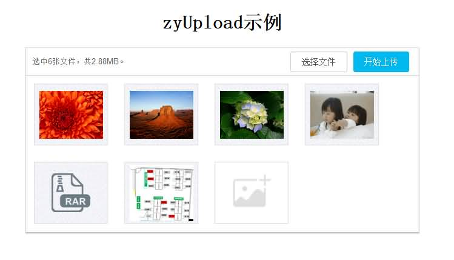
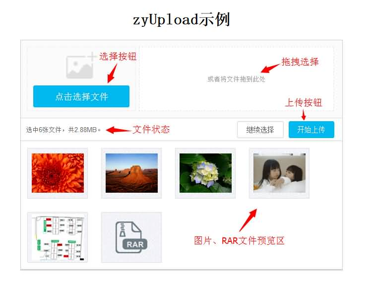
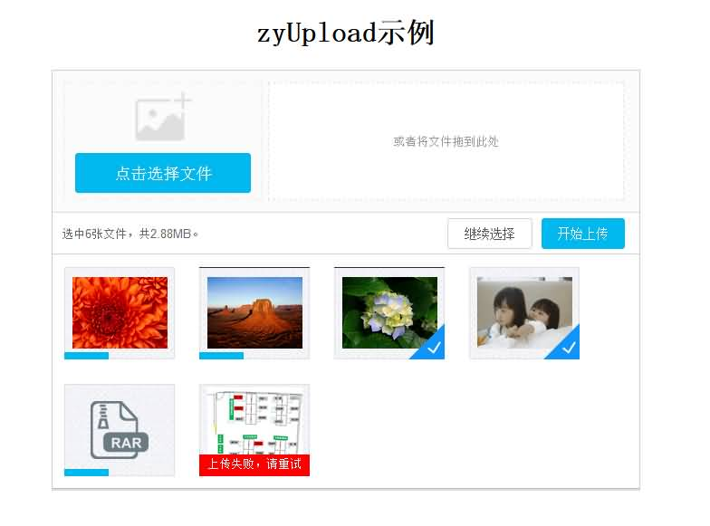
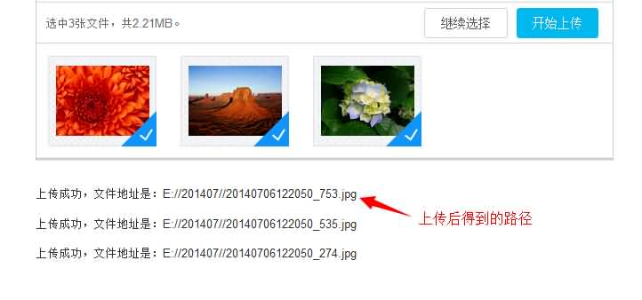

# zyUpload界面绝佳、体验超棒的HTML5上传插件

### 为毛线开发它

经过了两个星期做出了两个基于HTML5的多文件上传插件，之前在做网站的时候用到文件上传这一个功能，但是大多说都是基于Flash的，正好最近HTML5很火，而且渐渐壮大起来，感觉搞前端的不会个HTML5不像是做前端的，所以就萌生了自己写一个多文件并且支持拖拽预览的插件。

### 大概思路

此插件我分了两层：

1. 核心层zyFile：这一层只负责对文件的操作、上传，并且提供外部过滤和获取上传状态等回调方法。

2. 控制层zyUpload：这一层负责控制着文件的过滤和一些效果的实现，用户通过参数配置可以得到不同功能的上传组件。

### demo页面展示

1. 带有拖拽功能的页面

1. 不带有拖住功能的页面

1. 不带有拖住功能的页面

1. 上传状态和文件上传路径页面

1. 接下来的文章会具体的去解释zyFile、zyUpload的参数及方法.

这个文件代码目前只有209行（带注释），因为他只处理文件上传相关的逻辑，比如：选择、删除之类。它相当于人体的骨骼，肉体是zyUpload

### 参数配置

下面展示zyFile的属性及其对应的内容含义等,（灰色的参数不需要用户初始化）。

<table align="center"><tbody><tr><td style="word-break: break-all; background-color: rgb(187, 187, 187);" align="center" valign="middle" width="133">属性或方法名</td><td style="background-color: rgb(187, 187, 187); word-break: break-all;" align="center" valign="middle" width="137">参数值或默认方法</td><td style="background-color: rgb(187, 187, 187); word-break: break-all;" align="center" valign="middle" width="456">释义 </td></tr><tr><td style="word-break: break-all;" valign="top" width="133">fileInput</td><td style="word-break: break-all;" valign="top" width="137">null </td><td style="word-break: break-all;" valign="top" width="456">
选择文件按钮dom对象
</td></tr><tr><td style="word-break: break-all;" valign="top" width="133">uploadInput </td><td style="word-break: break-all;" valign="top" width="137">null </td><td style="word-break: break-all;" valign="top" width="456">
上传文件按钮dom对象
</td></tr><tr><td style="word-break: break-all;" valign="top" width="133">dragDrop </td><td style="word-break: break-all;" valign="top" width="137">null </td><td style="word-break: break-all;" valign="top" width="456">
拖拽敏感区域dom对象
</td></tr><tr><td style="word-break: break-all;" valign="top" width="133">url </td><td style="word-break: break-all;" valign="top" width="137">"" </td><td style="word-break: break-all;" valign="top" width="456">上传action绝对路径 </td></tr><tr><td style="word-break: break-all;" valign="top" width="133">uploadFile</td><td style="word-break: break-all;" valign="top" width="137">[] </td><td style="word-break: break-all;" valign="top" width="456">
需要上传的文件数组
</td></tr><tr><td style="word-break: break-all;" valign="top" width="133">lastUploadFile</td><td style="word-break: break-all;" valign="top" width="137">[] </td><td style="word-break: break-all;" valign="top" width="456">
上一次选择的文件数组，方便继续上传使用
</td></tr><tr><td style="word-break: break-all;" valign="top" width="133">perUploadFile</td><td style="word-break: break-all;" valign="top" width="137">[] </td><td style="word-break: break-all;" valign="top" width="456">

存放永久的文件数组，方便删除使用
</td></tr><tr><td style="word-break: break-all;" rowspan="1" colspan="1" valign="top" width="133">fileNum </td><td style="word-break: break-all;" rowspan="1" colspan="1" valign="top" width="137">0 </td><td style="word-break: break-all;" rowspan="1" colspan="1" valign="top" width="208">
代表文件总个数，因为涉及到继续添加，所以下一次添加需要在它的基础上添加索引
</td></tr><tr><td style="word-break: break-all;" valign="top" width="133">filterFile</td><td style="word-break: break-all;" valign="top" width="137">
function(files)&nbsp;{

&emsp;&emsp;return&nbsp;files;

}
</td><td style="word-break: break-all;" valign="top" width="456">
提供给外部的过滤文件格式等的接口，外部需要把过滤后的文件返回
</td></tr><tr><td style="word-break: break-all;" rowspan="1" colspan="1" valign="top">
onSelect
</td><td style="word-break: break-all;" rowspan="1" colspan="1" valign="top">
function(selectFile,&nbsp;files){}
</td><td style="word-break: break-all;" rowspan="1" colspan="1" valign="top">
提供给外部获取选中的文件，供外部实现预览等功能&nbsp;&nbsp;selectFile:当前选中的文件&nbsp;&nbsp;allFiles:还没上传的全部文件
</td></tr><tr><td style="word-break: break-all;" rowspan="1" colspan="1" valign="top">
onDelete
</td><td style="word-break: break-all;" rowspan="1" colspan="1" valign="top">
function(file,&nbsp;files){}
</td><td style="word-break: break-all;" rowspan="1" colspan="1" valign="top">
提供给外部获取删除的单个文件，供外部实现删除效果&nbsp;&nbsp;file:当前删除的文件&nbsp;&nbsp;files:删除之后的文件
</td></tr><tr><td style="word-break: break-all;" rowspan="1" colspan="1" valign="top">
onProgress
</td><td style="word-break: break-all;" rowspan="1" colspan="1" valign="top">
function(file,&nbsp;loaded,&nbsp;total){}
</td><td style="word-break: break-all;" rowspan="1" colspan="1" valign="top">
提供给外部获取单个文件的上传进度，供外部实现上传进度效果
 </td></tr><tr><td style="word-break: break-all;" rowspan="1" colspan="1" valign="top">
onSuccess
</td><td style="word-break: break-all;" rowspan="1" colspan="1" valign="top">
function(file,&nbsp;responseInfo){}
</td><td style="word-break: break-all;" rowspan="1" colspan="1" valign="top">
提供给外部获取单个文件上传成功，供外部实现成功效果
</td></tr><tr><td style="word-break: break-all;" rowspan="1" colspan="1" valign="top">
onFailure
</td><td style="word-break: break-all;" rowspan="1" colspan="1" valign="top">
function(file,&nbsp;responseInfo){}
</td><td style="word-break: break-all;" rowspan="1" colspan="1" valign="top">
提供给外部获取单个文件上传失败，供外部实现失败效果
</td></tr><tr><td style="word-break: break-all;" rowspan="1" colspan="1" valign="top">
onComplete
</td><td style="word-break: break-all;" rowspan="1" colspan="1" valign="top">
function(responseInfo){}
</td><td style="word-break: break-all;" rowspan="1" colspan="1" valign="top">
提供给外部获取全部文件上传完成，供外部实现完成效果
</td></tr><tr><td style="word-break: break-all;" rowspan="1" colspan="1" valign="top">
onDragOver
</td><td style="word-break: break-all;" rowspan="1" colspan="1" valign="top">
function()&nbsp;{}
</td><td style="word-break: break-all;" rowspan="1" colspan="1" valign="top">
提供给外部获取拖动移动在目标上的方法
</td></tr><tr><td style="word-break: break-all;" rowspan="1" colspan="1" valign="top">
onDragLeave
</td><td style="word-break: break-all;" rowspan="1" colspan="1" valign="top">function()&nbsp;{}</td><td style="word-break: break-all;" rowspan="1" colspan="1" valign="top">
提供给外部获取拖动离开的方法
</td></tr></tbody></table>

### 初始化示例

<pre>// 初始化插件
$("#demo").zyUpload({
    width            :   "650px",                 // 宽度
    height           :   "400px",                 // 宽度
    itemWidth        :   "120px",                 // 文件项的宽度
    itemHeight       :   "100px",                 // 文件项的高度
    url              :   "/upload/UploadAction",  // 上传文件的路径
    multiple         :   true,                    // 是否可以多个文件上传
    dragDrop         :   true,                    // 是否可以拖动上传文件
    del              :   true,                    // 是否可以删除文件
    finishDel        :   false,                    // 是否在上传文件完成后删除预览
    /* 外部获得的回调接口 */
    onSelect: function(selectFiles, allFiles){    // 选择文件的回调方法  selectFile:当前选中的文件  allFiles:还没上传的全部文件
        console.info("当前选择了以下文件：");
        console.info(selectFiles);
    },
    onDelete: function(file, files){              // 删除一个文件的回调方法 file:当前删除的文件  files:删除之后的文件
        console.info("当前删除了此文件：");
        console.info(file.name);
    },
    onSuccess: function(file, response){          // 文件上传成功的回调方法
        console.info("此文件上传成功：");
        console.info(file.name);
    },
    onFailure: function(file, response){          // 文件上传失败的回调方法
        console.info("此文件上传失败：");
        console.info(file.name);
    },
    onComplete: function(response){                 // 上传完成的回调方法
        console.info("文件上传完成");
        console.info(response);
    }
});</pre>

zyFile.js的全部代码：

<pre>/*
 * zyFile.js 基于HTML5 文件上传的核心脚本 http://www.52doit.com
 * by zhangyan 2014-06-21   QQ : 623585268
*/
 
var ZYFILE = {
    fileInput : null,             // 选择文件按钮dom对象
    uploadInput : null,           // 上传文件按钮dom对象
    dragDrop: null,                  // 拖拽敏感区域
    url : "",                        // 上传action路径
    uploadFile : [],                // 需要上传的文件数组
    lastUploadFile : [],          // 上一次选择的文件数组，方便继续上传使用
    perUploadFile : [],           // 存放永久的文件数组，方便删除使用
    fileNum : 0,                  // 代表文件总个数，因为涉及到继续添加，所以下一次添加需要在它的基础上添加索引
    /* 提供给外部的接口 */
    filterFile : function(files){ // 提供给外部的过滤文件格式等的接口，外部需要把过滤后的文件返回
        return files;
    },
    onSelect : function(selectFile, files){      // 提供给外部获取选中的文件，供外部实现预览等功能  selectFile:当前选中的文件  allFiles:还没上传的全部文件
         
    },
    onDelete : function(file, files){            // 提供给外部获取删除的单个文件，供外部实现删除效果  file:当前删除的文件  files:删除之后的文件
         
    },
    onProgress : function(file, loaded, total){  // 提供给外部获取单个文件的上传进度，供外部实现上传进度效果
         
    },
    onSuccess : function(file, responseInfo){    // 提供给外部获取单个文件上传成功，供外部实现成功效果
         
    },
    onFailure : function(file, responseInfo){    // 提供给外部获取单个文件上传失败，供外部实现失败效果
     
    },
    onComplete : function(responseInfo){         // 提供给外部获取全部文件上传完成，供外部实现完成效果
         
    },
     
    /* 内部实现功能方法 */
    // 获得选中的文件
    //文件拖放
    funDragHover: function(e) {
        e.stopPropagation();
        e.preventDefault();
        this[e.type === "dragover"? "onDragOver": "onDragLeave"].call(e.target);
        return this;
    },
    // 获取文件
    funGetFiles : function(e){  
        var self = this;
        // 取消鼠标经过样式
        this.funDragHover(e);
        // 从事件中获取选中的所有文件
        var files = e.target.files || e.dataTransfer.files;
        self.lastUploadFile = this.uploadFile;
        this.uploadFile = this.uploadFile.concat(this.filterFile(files));
        var tmpFiles = [];
         
        // 因为jquery的inArray方法无法对object数组进行判断是否存在于，所以只能提取名称进行判断
        var lArr = [];  // 之前文件的名称数组
        var uArr = [];  // 现在文件的名称数组
        $.each(self.lastUploadFile, function(k, v){
            lArr.push(v.name);
        });
        $.each(self.uploadFile, function(k, v){
            uArr.push(v.name);
        });
         
        $.each(uArr, function(k, v){
            // 获得当前选择的每一个文件   判断当前这一个文件是否存在于之前的文件当中
            if($.inArray(v, lArr) < 0){  // 不存在
                tmpFiles.push(self.uploadFile[k]);
            }
        });
         
        // 如果tmpFiles进行过过滤上一次选择的文件的操作，需要把过滤后的文件赋值
        //if(tmpFiles.length!=0){
            this.uploadFile = tmpFiles;
        //}
         
        // 调用对文件处理的方法
        this.funDealtFiles();
         
        return true;
    },
    // 处理过滤后的文件，给每个文件设置下标
    funDealtFiles : function(){
        var self = this;
        // 目前是遍历所有的文件，给每个文件增加唯一索引值
        $.each(this.uploadFile, function(k, v){
            // 因为涉及到继续添加，所以下一次添加需要在总个数的基础上添加
            v.index = self.fileNum;
            // 添加一个之后自增
            self.fileNum++;
        });
        // 先把当前选中的文件保存备份
        var selectFile = this.uploadFile;  
        // 要把全部的文件都保存下来，因为删除所使用的下标是全局的变量
        this.perUploadFile = this.perUploadFile.concat(this.uploadFile);
        // 合并下上传的文件
        this.uploadFile = this.lastUploadFile.concat(this.uploadFile);
         
        // 执行选择回调
        this.onSelect(selectFile, this.uploadFile);
        console.info("继续选择");
        console.info(this.uploadFile);
        return this;
    },
    // 处理需要删除的文件  isCb代表是否回调onDelete方法  
    // 因为上传完成并不希望在页面上删除div，但是单独点击删除的时候需要删除div   所以用isCb做判断
    funDeleteFile : function(delFileIndex, isCb){
        var self = this;  // 在each中this指向没个v  所以先将this保留
         
        var tmpFile = [];  // 用来替换的文件数组
        // 合并下上传的文件
        var delFile = this.perUploadFile[delFileIndex];
        //console.info(delFile);
        // 目前是遍历所有的文件，对比每个文件  删除
        $.each(this.uploadFile, function(k, v){
            if(delFile != v){
                // 如果不是删除的那个文件 就放到临时数组中
                tmpFile.push(v);
            }
        });
        this.uploadFile = tmpFile;
        if(isCb){  // 执行回调
            // 回调删除方法，供外部进行删除效果的实现
            self.onDelete(delFile, this.uploadFile);
        }
         
        console.info("还剩这些文件没有上传:");
        console.info(this.uploadFile);
        return true;
    },
    // 上传多个文件
    funUploadFiles : function(){
        var self = this;  // 在each中this指向没个v  所以先将this保留
        // 遍历所有文件  ，在调用单个文件上传的方法
        $.each(this.uploadFile, function(k, v){
            self.funUploadFile(v);
        });
    },
    // 上传单个个文件
    funUploadFile : function(file){
        var self = this;  // 在each中this指向没个v  所以先将this保留
        var formdata = new FormData();
        formdata.append("file", file);     
        // 添加裁剪的坐标和宽高发送给后台
        if($("#uploadTailor_"+file.index).length>0){
            // 除了这样获取不到zyUpload的值啊啊啊啊啊啊啊啊啊啊啊
            formdata.append("tailor", $("#uploadTailor_"+file.index).attr("tailor"));    
        }
        var xhr = new XMLHttpRequest();
        // 绑定上传事件
        // 进度
        xhr.upload.addEventListener("progress",     function(e){
            // 回调到外部
            self.onProgress(file, e.loaded, e.total);
        }, false); 
        // 完成
        xhr.addEventListener("load", function(e){
            // 从文件中删除上传成功的文件  false是不执行onDelete回调方法
            self.funDeleteFile(file.index, false);
            // 回调到外部
            self.onSuccess(file, xhr.responseText);
            if(self.uploadFile.length==0){
                // 回调全部完成方法
                self.onComplete("全部完成");
            }
        }, false);  
        // 错误
        xhr.addEventListener("error", function(e){
            // 回调到外部
            self.onFailure(file, xhr.responseText);
        }, false);  
         
        xhr.open("POST",self.url, true);
        xhr.send(formdata);
    },
    // 返回需要上传的文件
    funReturnNeedFiles : function(){
        return this.uploadFile;
    },
     
    // 初始化
    init : function(){  // 初始化方法，在此给选择、上传按钮绑定事件
        var self = this;  // 克隆一个自身
         
        if (this.dragDrop) {
            this.dragDrop.addEventListener("dragover", function(e) { self.funDragHover(e); }, false);
            this.dragDrop.addEventListener("dragleave", function(e) { self.funDragHover(e); }, false);
            this.dragDrop.addEventListener("drop", function(e) { self.funGetFiles(e); }, false);
        }
         
        // 如果选择按钮存在
        if(self.fileInput){
            // 绑定change事件
            this.fileInput.addEventListener("change", function(e) {
                self.funGetFiles(e); 
            }, false);    
        }
         
        // 如果上传按钮存在
        if(self.uploadInput){
            // 绑定click事件
            this.uploadInput.addEventListener("click", function(e) {
                self.funUploadFiles(e); 
            }, false);    
        }
    }
};</pre>

上面是吧整个上传插件的骨骼部分讲完了，接下来的文章会继续把肉体的部分的使用高速大家，源码也会提供下载，有什么不明白的请加我QQ留言（623585268），谢谢。

zyUpload JavaScript版实例代码：

[http://yun.baidu.com/share/link?shareid=3705093182&uk=2972370755](http://yun.baidu.com/share/link?shareid=3705093182&uk=2972370755)

zyUpload JAVA版实例代码:

[http://yun.baidu.com/share/link?shareid=3707308326&uk=2972370755](http://yun.baidu.com/share/link?shareid=3707308326&uk=2972370755)

zyUpload PHP版实例代码:

[http://yun.baidu.com/share/link?shareid=3709895291&uk=2972370755 ](http://yun.baidu.com/share/link?shareid=3709895291&uk=2972370755 )

### 一、概述

接下来要讲的是整个插件的血肉部分，zyUpload处理的东西比较多，比如：对文件格式、大小的过滤，设 置文件上传状态等。今天我把java版的源码放到了网盘上（/webContent/demo文件夹可以拿出来单独使用）。

我的整个项目的结构是这样的：

如果你想运行的话，直接打开/demo/demo.html文件就可以。

### 二、参数配置

<table><tbody><tr><td style="background-color: rgb(187, 187, 187); word-break: break-all;" align="center" valign="middle" width="125">
属性或方法名
</td><td style="background-color: rgb(187, 187, 187); word-break: break-all;" align="center" valign="middle" width="206">
参数值或默认方法
</td><td style="background-color: rgb(187, 187, 187); word-break: break-all;" align="center" valign="middle" width="392">
释义
</td></tr><tr><td style="word-break: break-all;" valign="top" width="125">width </td><td style="word-break: break-all;" valign="top" width="206">"" </td><td style="word-break: break-all;" valign="top" width="392">
插件宽度
</td></tr><tr><td style="word-break: break-all;" valign="top" width="125">height </td><td style="word-break: break-all;" valign="top" width="206">"" </td><td style="word-break: break-all;" valign="top" width="392">
插件高度
</td></tr><tr><td style="word-break: break-all;" valign="top" width="125">itemWidth </td><td style="word-break: break-all;" valign="top" width="206">"" </td><td style="word-break: break-all;" valign="top" width="392">
每一个预览区域的宽度
</td></tr><tr><td style="word-break: break-all;" valign="top" width="125">itemHeight </td><td style="word-break: break-all;" valign="top" width="206">"" </td><td style="word-break: break-all;" valign="top" width="392">每一个预览区域的高度</td></tr><tr><td style="word-break: break-all;" valign="top" width="125">url </td><td style="word-break: break-all;" valign="top" width="206">"" </td><td style="word-break: break-all;" valign="top" width="392">
上传文件的路径
</td></tr><tr><td style="word-break: break-all;" valign="top" width="125">
onSelect
</td><td style="word-break: break-all;" valign="top" width="206">
function(selectFiles,&nbsp;files){}
</td><td style="word-break: break-all;" valign="top" width="392">
选择文件的回调方法&nbsp;&nbsp;selectFile:当前选中的文件&nbsp;&nbsp;allFiles:还没上传的全部文件
</td></tr><tr><td style="word-break: break-all;" valign="top" width="125">
onDelete
</td><td style="word-break: break-all;" valign="top" width="206">
function(file,&nbsp;files){}
</td><td style="word-break: break-all;" valign="top" width="392">
删除一个文件的回调方法&nbsp;file:当前删除的文件&nbsp;&nbsp;files:删除之后的文件
</td></tr><tr><td style="word-break: break-all;" valign="top" width="125">
onSuccess
</td><td style="word-break: break-all;" valign="top" width="206">
function(file){}
</td><td style="word-break: break-all;" valign="top" width="392">
文件上传成功的回调方法
</td></tr><tr><td style="word-break: break-all;" rowspan="1" colspan="1" valign="top">onFailure</td><td style="word-break: break-all;" rowspan="1" colspan="1" valign="top" width="29">function(file){}</td><td style="word-break: break-all;" rowspan="1" colspan="1" valign="top" width="392">文件上传错误的回调方法</td></tr><tr><td style="word-break: break-all;" valign="top" width="125">

onComplete
</td><td style="word-break: break-all;" valign="top" width="206">
function(responseInfo){}
</td><td style="word-break: break-all;" valign="top" width="392">
上传全部完成的回调方法
</td></tr></tbody></table>

### 三、初始化示例

1. Html部分（demo.html）：

<pre>&lt;!DOCTYPE html>
&lt;html>
    &lt;head>
        &lt;meta charset="UTF-8">
        &lt;title>上传</title>
        &lt;!-- 引用控制层插件样式 -->
        &lt;link rel="stylesheet" href="control/css/zyUpload.css" type="text/css">
         
        &lt;!--图片弹出层样式 必要样式-->
        &lt;script type="text/javascript" src="jquery-1.7.2.js"></script>
        &lt;!-- 引用核心层插件 -->
        &lt;script type="text/javascript" src="core/zyFile.js"></script>
        &lt;!-- 引用控制层插件 -->
        &lt;script type="text/javascript" src="control/js/zyUpload.js"></script>
        &lt;!-- 引用初始化JS -->
        &lt;script type="text/javascript" src="demo.js"></script>
    &lt;/head>
    &lt;body>
        &lt;h1 style="text-align:center;">zyFile示例</h1>
        &lt;div id="demo" class="demo">
   
    &lt;/body>
&lt;/html></pre>

2. js脚本部分（demo.js）：

<pre>$(function(){
    // 初始化插件
    $("#demo").zyUpload({
        width            :   "650px",                 // 宽度
        height           :   "400px",                 // 宽度
        itemWidth        :   "120px",                 // 文件项的宽度
        itemHeight       :   "100px",                 // 文件项的高度
        url              :   "/upload/UploadAction",  // 上传文件的路径
        multiple         :   true,                    // 是否可以多个文件上传
        dragDrop         :   true,                    // 是否可以拖动上传文件
        del              :   true,                    // 是否可以删除文件
        finishDel        :   false,                    // 是否在上传文件完成后删除预览
        /* 外部获得的回调接口 */
        onSelect: function(selectFiles, allFiles){    // 选择文件的回调方法  selectFile:当前选中的文件  allFiles:还没上传的全部文件
            console.info("当前选择了以下文件：");
            console.info(selectFiles);
        },
        onDelete: function(file, files){              // 删除一个文件的回调方法 file:当前删除的文件  files:删除之后的文件
            console.info("当前删除了此文件：");
            console.info(file.name);
        },
        onSuccess: function(file, response){          // 文件上传成功的回调方法
            console.info("此文件上传成功：");
            console.info(file.name);
        },
        onFailure: function(file, response){          // 文件上传失败的回调方法
            console.info("此文件上传失败：");
            console.info(file.name);
        },
        onComplete: function(response){                 // 上传完成的回调方法
            console.info("文件上传完成");
            console.info(response);
        }
    });
     
});</pre>

到此为止，算是把整个上传插件讲解完成，在这里也十分感谢你的关注，过几天之后我会继续开发增强版的上传，会涉及到图片截取，html5拍照等等，总之，大家一起进步吧。

